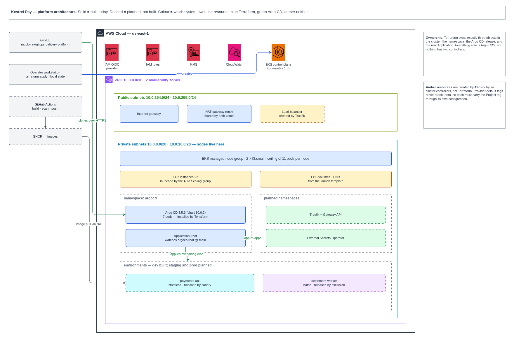
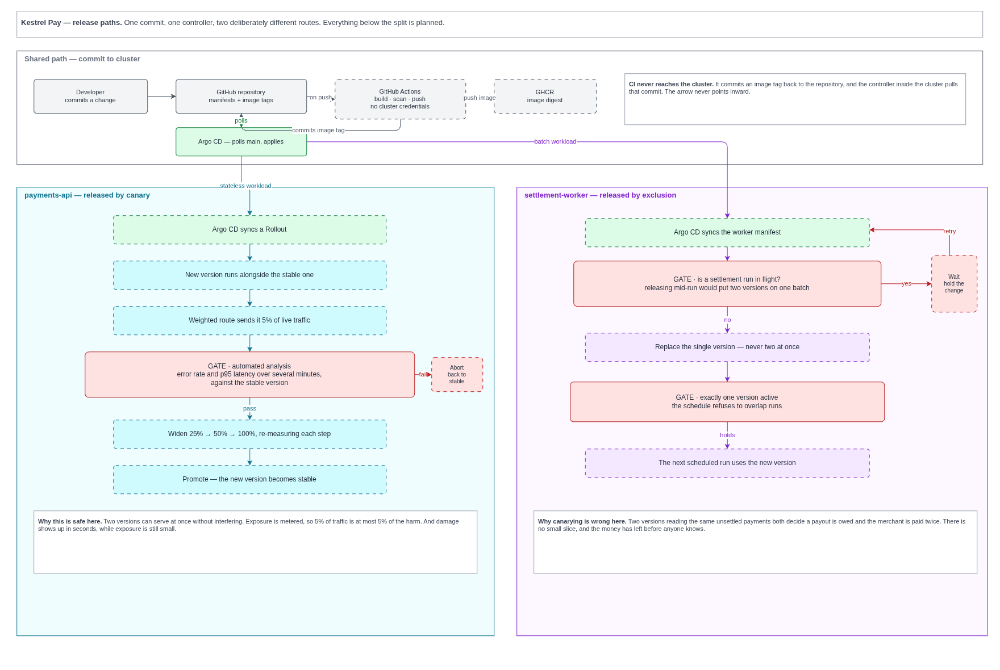

# Architecture

The system as built: what runs where, which component owns which resources,
and where the boundaries between them sit.

Solid outlines are built. Dashed outlines are planned and do not exist yet.
Colour shows ownership — blue for what the provisioning tooling creates, green
for what the delivery controller creates, amber for what neither of them
creates.

## The platform

## How a release reaches each workload

Export page 2 from the drawing as diagrams/release-paths.png, then
     uncomment the line below.

